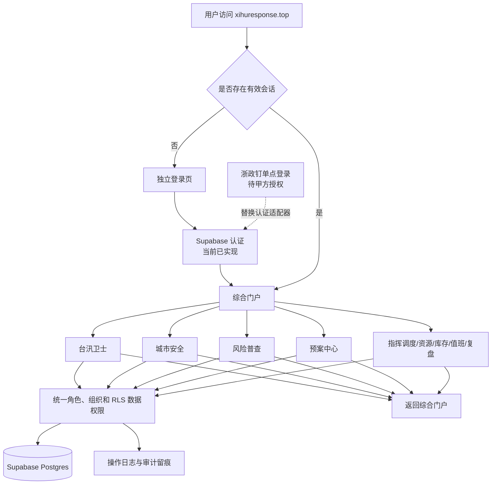
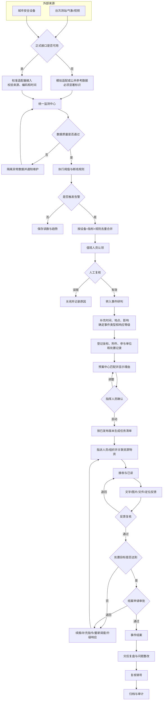
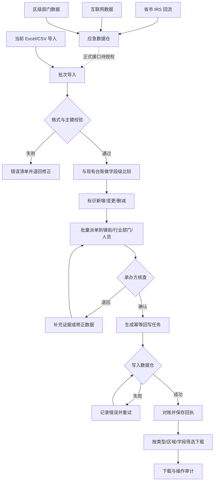
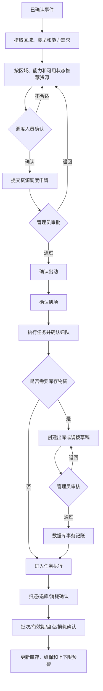
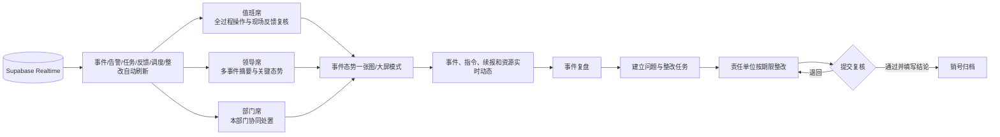

# 西湖区应急管理综合平台 SOP

本 SOP 将标书要求映射到当前产品页面，并明确三类边界：

- **已实现**：当前页面和数据库能够完成并留痕；
- **模拟适配**：平台内流程能够演示，但上下游并非正式政务接口；
- **待甲方接入**：必须取得账号、接口、旧数据、政务网络或第三方授权。

需求逐项对照见 [标书需求转译与当前产品覆盖矩阵](TENDER-COVERAGE.md)。

## 1. 统一入口、认证和子产品访问

执行规则：

1. 未登录用户只进入登录页；登录成功后回到原目标子产品。
2. `viewer` 只读，`member` 处理本人或所属组织业务，`admin` 管理全局、账号、组织和邀请码。
3. 账号停用后数据库拒绝业务访问；关键变更必须记录账号、时间、对象和结果。
4. 当前账号体系用于公网协作，不能对外宣称已经完成浙政钉单点登录。

## 2. 监测预警到事件结案主闭环

### 页面之间的跳转

| 当前页面/动作 | 下一页面 | 业务含义 | 当前状态 |
| --- | --- | --- | --- |
| 台汛卫士/城市安全“转入事件” | 预案中心 | 创建待研判事件并立即进入预案匹配 | 已实现 |
| 指挥调度中的既有事件 | 预案中心 | 通过产品导航进入并选择事件进行匹配 | 已实现，尚无事件行内快捷按钮 |
| 预案中心“人工确认并启动” | 指挥调度 | 按指定预案版本生成任务 | 已实现 |
| 指挥调度“调配资源” | 应急资源/物资库存 | 推荐队伍、装备和物资，形成调度申请并跟踪到归队 | 已实现，外部车载定位待接入 |
| 事件结案 | 灾后复盘 | 自动汇集任务时间线，登记问题、整改、复核和销号 | 已实现 |

### 不允许跳过的控制点

- 模拟或公共参考数据不得直接触发不可逆的外部指令，必须人工复核。
- 预案推荐只提供辅助依据，必须由有权限的指挥人员确认。
- 库存出入库和调拨在审核前不得改变库存余额；撤销必须生成反向冲销记录。
- 事件未完成任务、未说明异常或未复核时，不应直接结案。

## 3. 预案数字化与版本发布

```mermaid
flowchart LR
    DOC[纸面/电子预案] --> EDIT[在线录入正文、类型、等级和关键词]
    EDIT --> TEMPLATE[配置责任人、资源和任务模板]
    TEMPLATE --> DRAFT[草稿版本]
    DRAFT --> DIFF[查看与上一版本修订对比]
    DIFF --> SIGN[部门会签与审批意见]
    SIGN --> REVIEW[送审]
    REVIEW --> DECIDE{管理员审核}
    DECIDE -- 退回 --> DRAFT
    DECIDE -- 通过 --> PUB[发布版本]
    PUB --> EXPORT[导出正式 Word 兼容文档]
    EXPORT --> MATCH[参与事件匹配]
    MATCH --> START[人工确认启动]
    START --> SNAPSHOT[锁定本次使用的版本]
    SNAPSHOT --> TASK[生成结构化任务]
    TASK --> RESULT[执行反馈与复盘]
    RESULT --> NEW[复制新版本并优化]
    NEW --> DRAFT
```

当前匹配依据为可解释的类型、响应等级、关键词和配置权重。标书要求的 NLP、动态调整和个性化推荐，在取得真实预案、历史事件、标注数据及验收准确率后进入模型评测；未评测模型不得自动替代人工决策。

## 4. 风险普查数据确认与回写

当前“回写”使用明确标识的模拟适配器。取得真实数据仓接口后，必须完成字段映射、身份认证、幂等键、失败重试、回执保存和全量对账，才能将状态改为正式接入。

## 5. 资源与库存保障流程

## 6. 指挥席位、实时动态与复盘整改

当前实时能力是已登录用户之间的数据库变更推送和自动刷新。短信、电话、浙政钉待办、真实车辆轨迹和硬件告警推送仍需对应服务和甲方接口，不能以页面实时刷新代替正式送达验收。

## 7. 异常、降级与外部边界

| 场景 | 处理要求 |
| --- | --- |
| 浙政钉不可用 | 当前公网协作账号可用于研发演示；正式环境按甲方要求启用认证降级或停止访问策略 |
| 监测接口中断 | 显示最后更新时间和离线状态，不得把历史值冒充实时值；记录断线并补传 |
| 短信/语音/移动端未接入 | 仅显示“模拟渠道”，不得宣称已经送达；平台内任务状态继续留痕 |
| 风险回写失败 | 保留待重试任务、错误原因和幂等键，不重复写入，不把失败标记为成功 |
| 库存不足 | 阻止审核记账，要求改量、换仓或重新调度 |
| 权限不足或账号停用 | 数据库层拒绝访问并记录必要的安全日志 |
| 外部系统接入 | 必须先完成授权、字段/编码映射、安全认证、联调、异常演练和验收 |

## 8. 正式交付门槛

以下工作不属于“画完页面即可完成”，必须由采购人、原系统厂商、云和测评单位共同配合：

1. 浙政钉 SSO、组织用户同步和移动端联调；
2. 原台汛卫士、城市安全、风险普查的源码/数据库盘点、裁剪、迁移、校验和回退演练；
3. IRS、应急数据仓、气象、视频、物联网、短信和语音正式接口；
4. 信创软硬件兼容验证、政务云部署及符合性测评；
5. 等保定级、整改、测评、备案，以及数据分级分类、备份恢复和安全制度；
6. 不少于 1 个月试运行、培训和使用手册、验收报告、一年免费运维与 7×24 小时服务组织。
