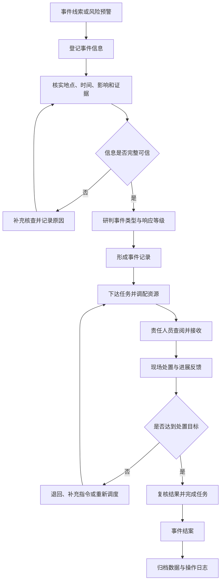
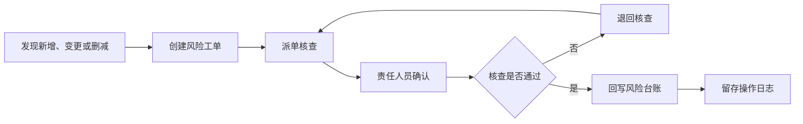

# 西湖区应急管理综合平台 SOP

## 应急事件处置闭环

## 风险普查数据治理闭环

## 角色职责

| 角色 | 主要职责 |
| --- | --- |
| viewer | 查看本人获准访问的信息，不得修改业务数据 |
| member | 登记事件、维护任务、处理风险工单并提交反馈 |
| admin | 查看全局数据、监督处置闭环、管理成员角色和审计日志 |

所有关键动作均应记录操作时间、操作账号、业务对象和处理结果。遇到信息不完整、处置失败或核查不通过时，应回到相应核查或调度节点，不得直接跳过复核结案。
