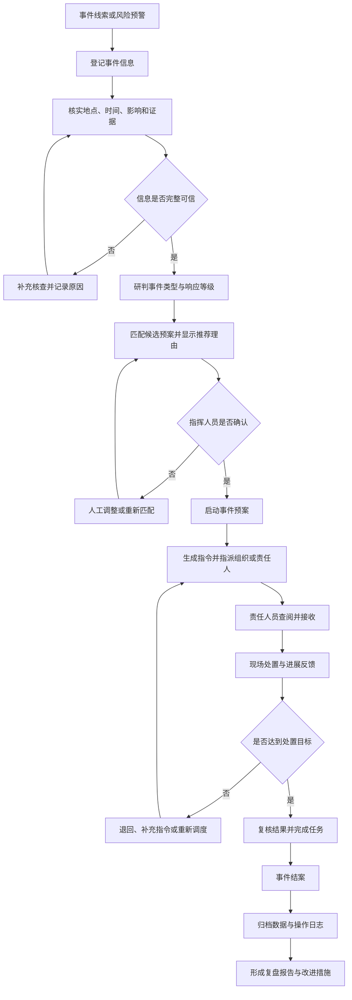
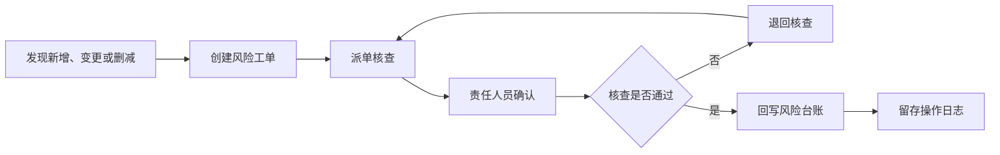

# 西湖区应急管理综合平台 SOP

## 应急事件处置闭环

## 风险普查数据治理闭环

## 角色职责

| 角色 | 主要职责 |
| --- | --- |
| viewer | 查看本人获准访问的信息，不得修改业务数据 |
| member | 登记事件，处理指派给本人或所属组织的任务/风险工单并提交反馈 |
| admin | 查看全局数据、监督处置闭环，管理组织树、成员归属、账号启停、邀请码和审计日志 |

所有关键动作均应记录操作时间、操作账号、业务对象和处理结果。遇到信息不完整、处置失败或核查不通过时，应回到相应核查或调度节点，不得直接跳过复核结案。

## 外部系统数据边界

- 实时雨情、水情、风情、桥隧液位、视频和城市安全设备在未取得接口授权时只使用明确标识的模拟数据。
- 模拟预警可转入事件研判，但必须由有权限的人员进行人工复核。
- IRS、应急数据仓、浙政钉、短信、语音和物联网接入必须通过正式适配器联调和验收后，才能将页面状态由“等待接入”改为“已接入”。
