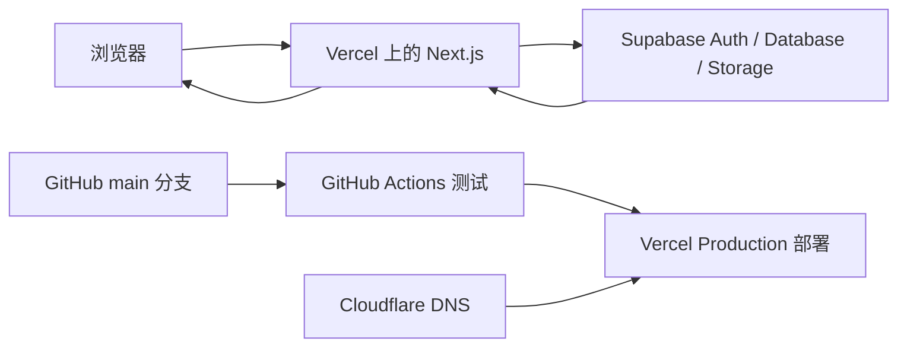
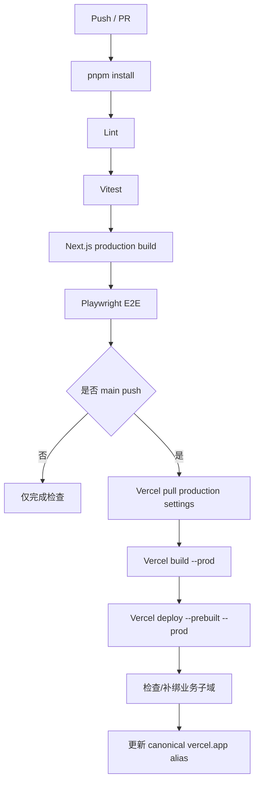

# Supabase 与 Vercel 新手协作指南

> 适用项目：西湖区应急管理综合平台
>
> 仓库：<https://github.com/Robot-TZ/xihu-emergency-management-platform>
>
> 正式地址：<https://xihuresponse.top>
>
> 本文最后核对：2026-10-10

这不是一篇脱离项目的 Supabase/Vercel 产品说明，而是一份“第一次接手本项目时该去哪里、看什么、改什么、如何安全发布”的操作手册。

## 1. 先用一句话理解三个平台

| 平台 | 在本项目中的作用 | 可以把它理解成 |
| --- | --- | --- |
| GitHub | 保存代码、迁移文件、文档和测试；触发自动检查与发布 | 项目的“源文件仓库和发布开关” |
| Supabase | 登录、Postgres 数据库、权限控制、附件存储、实时数据刷新 | 项目的“后台、数据库和用户系统” |
| Vercel | 构建并运行 Next.js，提供网址、服务端 API、环境变量和部署记录 | 项目的“网站服务器和发布平台” |

用户在网页上保存一条事件时，数据流大致如下：



需要特别区分三种权限：

1. **Supabase 平台权限**：谁能进入 Supabase Dashboard、看数据库和配置。
2. **Vercel 平台权限**：谁能进入 Vercel Dashboard、看部署、域名和环境变量。
3. **网站内部角色**：`viewer`、`member`、`admin`，决定登录网站后能做什么。

加入 Supabase/Vercel 团队不会自动成为网站管理员；网站中的 `admin` 也不等于拥有 Supabase/Vercel 控制台权限。

## 2. 本项目当前使用的实例

### 2.1 Supabase

- Project Ref：`stccnbdredcxdjjfyuxf`
- Dashboard：<https://supabase.com/dashboard/project/stccnbdredcxdjjfyuxf>
- 当前控制台显示名仍是早期名称 `xihu-emergency-stage-one`。这只是 Supabase 项目显示名，不影响 GitHub 项目名、Vercel 项目名和正式域名。
- 项目使用东京区域 `ap-northeast-1`。

免费 Supabase 项目长期缺少活动时可能进入 `INACTIVE`。这时网站可能能打开，但登录、数据库查询和保存会失败。恢复方法：进入组织与项目，点击 **Resume project**，等待状态变成 `ACTIVE_HEALTHY`。官方说明见 [Project Pausing](https://supabase.com/docs/guides/platform/free-project-pausing)。

### 2.2 Vercel

- Project：`xihu-emergency-management-platform`
- Framework：Next.js
- Node.js：24.x
- Dashboard：登录 Vercel 后，在 Projects 中打开同名项目。
- 正式根域名：`xihuresponse.top`（目前 308 跳转到 `www.xihuresponse.top`）
- 各业务子域名均绑定同一个 Vercel 项目，由应用按 hostname 决定显示哪个模块。

### 2.3 GitHub

- Repository：<https://github.com/Robot-TZ/xihu-emergency-management-platform>
- 生产分支：`main`
- 自动化文件：`.github/workflows/ci.yml`
- 推送到 `main` 后，先执行 Lint、单元测试、构建和浏览器测试；全部成功后才部署生产环境。

## 3. 新同学第一次参与前要取得什么权限

请项目负责人分别完成以下邀请，不要共用个人账号：

1. GitHub 仓库协作者权限；
2. Supabase 项目或组织的只读/开发权限；
3. Vercel 项目或 Team 的适当权限；
4. 一个网站内部成员账号和邀请码。

建议普通贡献者先取得 GitHub 写权限、Supabase/Vercel 只读权限和网站 `member` 角色。只有负责数据库、部署、域名或密钥的维护者才需要更高平台权限。

账号安全要求：

- GitHub、Supabase 和 Vercel 均开启双因素认证；
- 不通过微信、Issue、代码文件或截图传递 API Key、Token、密码；
- 不把生产环境的 `service_role`、数据库密码或 Vercel Token 放进 `.env.example`；
- 邀请码只在生成时显示一次，数据库中只保存哈希，之后无法反查原文。

## 4. 在自己电脑上运行项目

### 4.1 安装基础工具

需要安装：

- Git；
- Node.js 22 或更高版本（CI 当前使用 Node.js 24）；
- pnpm 11.19.0；
- 一个现代浏览器。

```bash
git clone https://github.com/Robot-TZ/xihu-emergency-management-platform.git
cd xihu-emergency-management-platform
corepack enable
pnpm install --frozen-lockfile
```

### 4.2 准备环境变量

项目提供 [.env.example](../.env.example) 作为字段清单。复制为不会提交的 `.env.local`：

```bash
cp .env.example .env.local
```

需要理解两类变量：

| 变量 | 用途 | 是否进入浏览器 | 推荐保存位置 |
| --- | --- | --- | --- |
| `NEXT_PUBLIC_SUPABASE_URL` | Supabase 项目 URL | 是 | `.env.local` / Vercel Config |
| `NEXT_PUBLIC_SUPABASE_PUBLISHABLE_KEY` | Supabase Publishable Key | 是，本来就是公开客户端凭据 | `.env.local` / Vercel Config |
| `NEXT_PUBLIC_TMAP_KEY` | 腾讯地图浏览器 Key | 是 | `.env.local` / GitHub Secret / Vercel Config |
| `DEEPSEEK_API_KEY` | AI 预案助手服务端密钥 | **否** | Vercel Secret / 本地 `.env.local` |
| `DEEPSEEK_MODEL` | DeepSeek 模型名 | 否 | Vercel Config / `.env.local` |

凡是 `NEXT_PUBLIC_` 开头的变量都会进入浏览器代码，绝不能用来保存服务端密钥。当前 [lib/supabase/config.ts](../lib/supabase/config.ts) 中保留了 Supabase URL 与 Publishable Key 的公开后备值，便于项目运行；为了让新环境可替换，仍建议在环境变量中显式配置。永远不要把 `service_role` Key 放进这个文件或任何 `NEXT_PUBLIC_` 变量。

如果已安装并登录 Vercel CLI，可以把 Development 环境的配置拉到本机：

```bash
pnpm dlx vercel@59.23.2 link
pnpm dlx vercel@59.23.2 env pull .env.local --environment=development
```

这里固定使用与项目 CI 相同的 CLI 版本，避免同组成员因工具版本不同得到不一致结果。

注意：`vercel env pull` 会覆盖目标文件；生产和预览的 Secret 也不会被拉回。执行前先确认本地自定义值已经备份。

### 4.3 启动与验证

```bash
pnpm dev
```

- 正常入口：<http://localhost:3000>
- 仅供本地开发的演示入口：<http://localhost:3000/?demo=1&view=overview>

演示入口把数据保存在浏览器本地，只用于界面和流程测试；它不等于 Supabase 云端数据。

提交前执行：

```bash
pnpm lint
pnpm test
pnpm build
pnpm test:e2e
```

## 5. Supabase 控制台各区域在本项目中负责什么

打开项目 Dashboard 后，最常用的是以下区域。控制台菜单名称偶尔会更新，以功能含义为准。

### 5.1 Table Editor / Database Tables

这里查看真实业务表和数据。不要为了“修好一条数据”随意改表结构。

| 业务 | 主要数据表 | 对应前端 |
| --- | --- | --- |
| 用户与权限 | `profiles`、`organizations`、`organization_members`、`team_invites`、`invite_redemptions` | `components/workflow-pages.tsx`、`components/auth-panel.tsx` |
| 指挥事件 | `events`、`tasks`、`event_participants`、`event_updates`、`task_feedbacks`、`business_attachments` | `components/workflow-pages.tsx`、`components/command-experience.tsx` |
| 预案中心 | `emergency_plans`、`plan_versions`、`plan_task_templates`、`plan_review_comments` | `components/plan-center.tsx`、`components/plan-drafting-assistant.tsx` |
| 应急资源 | `resource_assets`、`resource_dispatches` | `components/resource-inventory-center.tsx` |
| 物资库存 | `warehouses`、`inventory_items`、`inventory_balances`、`inventory_documents`、`inventory_document_lines`、`inventory_movements`、`inventory_batches`、`inventory_stocktakes` | `components/resource-inventory-center.tsx` |
| 风险普查 | `risk_records`、`risk_import_batches`、`risk_field_changes`、`risk_writeback_jobs` | `components/risk-survey-center.tsx` |
| 台汛/城市安全 | `monitoring_assets`、`monitoring_readings`、`monitoring_rules`、`monitoring_alerts`、`monitoring_alert_actions` | `components/monitoring-center.tsx` |
| 值班/接入等通用记录 | `operational_records` | `components/experience-center.tsx`、`components/product-pages.tsx` |
| 灾后复盘 | `review_issues`，并关联 `events`、`tasks` | `components/experience-center.tsx` |
| 审计 | `activity_logs` | `components/product-pages.tsx` 中的 `LogsPage` |

字段的 TypeScript 对照集中在 [lib/types.ts](../lib/types.ts)。数据库实际结构以 `supabase/migrations/` 为准，不能只改 TypeScript 类型。

### 5.2 Authentication / Users

这里能看到注册用户、邮箱确认状态和最近登录信息。网站的登录代码分布在：

- [components/auth-panel.tsx](../components/auth-panel.tsx)：注册、登录、邀请码兑换；
- [components/login-page.tsx](../components/login-page.tsx)：登录页面布局；
- [app/auth/confirm/route.ts](../app/auth/confirm/route.ts)：邮箱确认回调；
- [app/page.tsx](../app/page.tsx)：未登录时显示登录页，已登录时进入门户；
- [lib/supabase/proxy.ts](../lib/supabase/proxy.ts)：刷新 Cookie 会话；
- [lib/supabase/cookie-options.ts](../lib/supabase/cookie-options.ts)：跨 `*.xihuresponse.top` 子域共享登录。

注意：Authentication 中“用户存在”不代表 `profiles` 表中账号已启用，也不代表拥有 `member/admin` 角色。网站的角色和启停状态保存在 `profiles`。

如果修改登录域名或回调路径，要同时检查 Supabase Authentication 的 URL Configuration：

- Site URL；
- Redirect URLs；
- 正式根域、`www`、本地开发地址；
- 不要使用过于宽泛的生产通配跳转规则。

### 5.3 SQL Editor

SQL Editor 适合：

- 查询和排查数据；
- 在提交 migration 前验证 SQL；
- 查看约束、索引和策略结果。

它不应成为唯一修改记录。正式结构变更必须落到 `supabase/migrations/` 并提交 GitHub，否则其他同学、新环境和灾难恢复都无法重现。

### 5.4 Database Policies / RLS

RLS 是本项目真正的数据权限边界。前端隐藏按钮只改善体验，不能替代 RLS。

当前主要规则包括：

- 账号必须在 `profiles` 中处于启用状态；
- `viewer` 主要只读；
- `member` 可以维护自己创建、指派给自己或所属组织的数据；
- `admin` 可以执行发布、审核、记账、成员管理等高风险操作；
- 预案已发布版本和库存已记账流水不能按普通草稿方式随意改写。

修改 RLS 时至少检查：

1. `SELECT`、`INSERT`、`UPDATE`、`DELETE` 是否分别需要策略；
2. `UPDATE` 是否同时有 `USING` 和 `WITH CHECK`；
3. 是否按 `auth.uid()`、组织归属或管理员身份限制行；
4. 新表是否已经 `enable row level security`；
5. 是否向 `authenticated` 授予了必要但不过度的表权限；
6. 不要用 `user_metadata` 做授权依据；
7. 不要为了省事把 `service_role` 放到浏览器。

官方参考：[Row Level Security](https://supabase.com/docs/guides/database/postgres/row-level-security)、[Securing your API](https://supabase.com/docs/guides/api/securing-your-api)。

### 5.5 Storage

本项目有私有桶 `business-attachments`，用于事件和任务相关图片、文件。对应代码在 [components/emergency-app.tsx](../components/emergency-app.tsx)：

- 上传后把文件路径写入 `business_attachments` 表；
- 下载时创建短期 Signed URL；
- 上传数据库记录失败时删除刚上传的对象，避免垃圾文件；
- 桶不是公开读，不能直接拼接永久公开 URL。

扩展新附件类型时，应继续使用私有桶、受控路径和短时签名地址，并同时设计 `storage.objects` 的 RLS。

官方参考：[Storage Access Control](https://supabase.com/docs/guides/storage/security/access-control)、[Serving assets](https://supabase.com/docs/guides/storage/serving/downloads)。

### 5.6 Realtime

项目对事件、任务、告警、反馈、调度和整改等表订阅 `postgres_changes`。订阅入口在 [components/emergency-app.tsx](../components/emergency-app.tsx)，发布表配置在迁移 `20260920140331_deepen_incident_command_workflows.sql`。

新增需要实时刷新的表时，要同时：

1. 把表加入 `supabase_realtime` publication；
2. 在前端订阅表名；
3. 为订阅用户配置正确的 `SELECT` RLS；
4. 评估高并发下每个订阅者都要进行授权检查的开销。

官方参考：[Postgres Changes](https://supabase.com/docs/guides/realtime/postgres-changes)。

### 5.7 Logs、Advisors 与 API Settings

- **Logs**：排查 Auth、Postgres、Storage、Realtime 请求错误；
- **Security Advisor**：检查未启用 RLS、危险函数等问题；
- **Performance Advisor**：检查缺失索引和慢查询；
- **Settings / API Keys**：取得 Project URL 与 Publishable Key；
- Secret / `service_role` 只允许服务端受控使用，本项目浏览器端不需要它。

## 6. 数据库修改的正确方法

### 6.1 只改页面，不改数据库

例如修改标题、按钮说明、布局或筛选方式：

1. 找到对应 `components/*.tsx`；
2. 样式一般在 `app/globals.css`；
3. 修改后运行 Lint、测试和构建；
4. 不需要 Supabase migration。

### 6.2 给现有业务增加一个字段

以“事件增加现场联系人”为例：

1. 在 Supabase CLI 中先查看当前命令：

   ```bash
   pnpm dlx supabase@latest --help
   pnpm dlx supabase@latest migration --help
   ```

2. 创建 migration，不要自己编造时间戳文件名：

   ```bash
   pnpm dlx supabase@latest migration new add_event_contact
   ```

3. 在生成的 SQL 中增加列、约束、必要索引和注释；
4. 更新 `lib/types.ts`；
5. 更新 `components/emergency-app.tsx` 中的读取、写入和导入导出；
6. 更新显示/编辑该字段的组件；
7. 补充测试；
8. 在测试环境应用并验证，再对共享项目执行 migration；
9. 提交 migration、代码、测试和文档到同一个 PR。

### 6.3 新增一张表

新表至少需要考虑：

- 主键和时间字段；
- 与事件、用户或组织的外键；
- 外键索引；
- 状态字段的 `check` 约束；
- RLS 和四类操作策略；
- `anon`/`authenticated` 的 Data API grant；
- 是否需要 Realtime；
- 是否需要活动日志；
- 是否需要导入导出和删除限制。

不要在生产 Table Editor 中先建表再忘记 migration。结构源文件必须能让一个全新的 Supabase 项目按顺序重建。

### 6.4 migration 与生产数据的边界

- 新增表/列/索引通常可迁移；
- 删除表、删除列、改类型、批量重写必须先备份并设计回退；
- 不要直接编辑已经在共享项目执行过的旧 migration，应新增一个修正 migration；
- 库存记账等多表一致性操作优先通过数据库函数/事务完成；
- 完成后运行 Supabase Advisors 并进行真实查询验证。

## 7. 本项目 migration 文件怎么读

| migration | 主要内容 |
| --- | --- |
| `20260918140337_stage_one_schema.sql` | 用户资料、事件、任务、风险、日志、邀请码基础表和第一批 RLS |
| `20260918140525_invite_redemption_hardening.sql` | 邀请码只存哈希、兑换留痕和触发器加固 |
| `20260919012409_phase_two_product_core.sql` | 通用业务记录模型 |
| `20260919125352_organization_access_control.sql` | 组织树、人员归属、账号启停和组织范围权限 |
| `20260919130321_*`、`20260919130427_*` | 外键索引与指派完整性保护 |
| `20260919214821_professional_plan_center.sql` | 预案、版本、任务模板 |
| `20260920015105_plan_lifecycle_policy_hardening.sql` | 预案生命周期写权限加固 |
| `20260920021405_resource_inventory_risk_closures.sql` | 资源、仓库、库存单据、风险批次/回写及事务函数 |
| `20260920034103_unified_monitoring_command_center.sql` | 监测资产、读数、规则、告警及处置函数 |
| `20260920140331_deepen_incident_command_workflows.sql` | 参与单位、续报审批、附件、反馈、会签、调度、批次盘点、复盘整改、Storage 与 Realtime |
| `20260920152810_increase_invite_use_limit.sql` | 邀请码默认及现有容量提升到 100 次 |

文件名按时间排序，后面的文件依赖前面的结构。

## 8. Vercel 控制台各区域在本项目中负责什么

### 8.1 Deployments

每次部署都有独立 URL、提交信息、构建日志和状态。常见状态：

- `QUEUED`：等待构建；
- `BUILDING`：正在构建；
- `READY`：可访问；
- `ERROR`：构建或配置失败。

排查线上“没有更新”时先确认：

1. GitHub 的最新 commit 是否在 `main`；
2. GitHub Actions 是否全部通过；
3. Vercel 最新 Production Deployment 是否对应同一个 commit；
4. 自定义域名当前指向哪个 deployment；
5. 浏览器是否只是缓存了旧页面。

### 8.2 Settings / Environment Variables

这里保存生产和预览环境配置。当前 Vercel 已有：

- `DEEPSEEK_API_KEY`：Secret，Production + Preview；
- `DEEPSEEK_MODEL`：Config，Production + Preview。

Supabase URL 和 Publishable Key 当前有代码中的公开后备值；为方便迁移，建议后续也在 Vercel 明确设置 `NEXT_PUBLIC_SUPABASE_URL` 和 `NEXT_PUBLIC_SUPABASE_PUBLISHABLE_KEY`。

修改环境变量后必须重新部署，旧 deployment 不会自动获得新值。Production、Preview、Development 可配置不同值，避免预览分支写入生产数据库。

官方参考：[Environment Variables](https://vercel.com/docs/environment-variables)。

### 8.3 Settings / Domains

当前已验证的业务域名：

| 域名 | 页面 | 代码映射 |
| --- | --- | --- |
| `www.xihuresponse.top` | 登录/综合门户 | `portal` |
| `typhoon.xihuresponse.top` | 台汛卫士 | `typhoon` |
| `plan.xihuresponse.top` | 预案中心 | `plans` |
| `command.xihuresponse.top` | 指挥调度 | `command` |
| `resource.xihuresponse.top` | 应急资源 | `resources` |
| `inventory.xihuresponse.top` | 物资库存 | `inventory` |
| `risk.xihuresponse.top` | 风险普查 | `risks` |
| `city.xihuresponse.top` | 城市安全 | `city` |
| `duty.xihuresponse.top` | 应急值班 | `duty` |
| `data.xihuresponse.top` | 数据管理 | `data` |
| `review.xihuresponse.top` | 灾后复盘 | `reviews` |
| `admin.xihuresponse.top` | 后台管理/操作日志 | `admin` / `logs` |

映射代码在 [lib/product-routing.ts](../lib/product-routing.ts)。Vercel 绑定域名只解决“请求到达项目”，真正显示哪个页面由该文件根据 hostname 判断。

DNS 当前由 Cloudflare 托管，域名注册仍在阿里云。三者关系是：

- 阿里云：域名注册所有权；
- Cloudflare：权威 DNS；
- Vercel：网站部署和 HTTPS 终点。

新增子域名时必须同时完成：

1. `lib/product-catalog.ts` 中增加产品页面；
2. `lib/product-routing.ts` 增加页面与子域名映射；
3. `components/emergency-app.tsx` 增加渲染分支；
4. Cloudflare 增加正确 DNS 记录；
5. Vercel Domains 绑定并等待 `verified`；
6. 如需长期自动补绑，在 `.github/workflows/ci.yml` 的域名循环中加入它；
7. 检查跨子域 Cookie 和未登录回跳；
8. 增加路由测试。

不要照抄固定 A/CNAME 值；以 Vercel 为这个项目和域名实际显示的 DNS 要求为准。不要删除无关的 MX、邮件验证 TXT 等记录。官方参考：[Adding a custom domain](https://vercel.com/docs/domains/working-with-domains/add-a-domain)。

### 8.4 Functions / Logs

Next.js Route Handler 会成为 Vercel Function。例如 AI 预案接口位于：

```text
app/api/ai/plan-draft/route.ts
```

出现 AI 500/502/504、登录回调异常或服务端报错时，应查看对应 deployment 的 Runtime Logs，并按请求时间、路径和状态码筛选。日志中不得打印密码、Cookie、Token、API Key 或完整敏感业务资料。

## 9. 本项目是怎样自动发布的

[.github/workflows/ci.yml](../.github/workflows/ci.yml) 定义了两个工作：



GitHub Production Environment 中保存：

- `VERCEL_TOKEN`；
- `VERCEL_ORG_ID`；
- `VERCEL_PROJECT_ID`；
- `NEXT_PUBLIC_TMAP_KEY`。

这些值不应写进仓库。普通贡献者不需要取得 Token，只需提交 PR；维护者合并到 `main` 后，工作流自动部署。

## 10. 推荐的日常开发流程

不要直接在 `main` 上试验：

```bash
git switch main
git pull --ff-only origin main
git switch -c feat/short-description
```

完成修改后：

```bash
pnpm lint
pnpm test
pnpm build
pnpm test:e2e
git status
git add <本次相关文件>
git commit -m "feat: describe the change"
git push -u origin feat/short-description
```

然后创建 Pull Request。PR 中写清：

- 为什么改；
- 改了哪些页面、表、权限或环境变量；
- 如何验证；
- 是否有 migration；
- 是否需要新域名、Secret 或外部接口；
- 哪些部分仍是模拟能力。

Preview 用于测试，不应默认连接生产数据库。合并后查看 GitHub Actions 和 Vercel Production 是否成功。

## 11. “我想改某个设计”应该去哪里

| 想修改的内容 | 主要位置 | 还要一起检查 |
| --- | --- | --- |
| 网站标题、全局元数据 | `app/layout.tsx` | README、浏览器标题 |
| 登录页 | `components/login-page.tsx`、`components/auth-panel.tsx` | Supabase Auth URL、回调路由 |
| 综合门户卡片与模块清单 | `lib/product-catalog.ts`、`components/product-pages.tsx` | 路由测试、子域名 |
| 子域名映射 | `lib/product-routing.ts` | Vercel Domains、Cloudflare、Cookie |
| 全局颜色、间距、响应式 | `app/globals.css` | 移动端、键盘焦点、对比度 |
| 指挥调度 | `components/workflow-pages.tsx`、`components/command-experience.tsx` | `events/tasks` 及深化流程表 |
| 预案中心 | `components/plan-center.tsx` | 预案四张表、生命周期 RLS |
| AI 预案助手界面 | `components/plan-drafting-assistant.tsx` | 服务端接口、DeepSeek 环境变量 |
| AI 提示和输出校验 | `lib/plan-drafting.ts` | 单元测试、数据合规声明 |
| AI 服务端接口 | `app/api/ai/plan-draft/route.ts` | Vercel Logs、权限、限流、Secret |
| 应急资源/库存 | `components/resource-inventory-center.tsx` | 库存事务函数和 RLS |
| 风险普查 | `components/risk-survey-center.tsx` | 批次、差异、回写任务 |
| 台汛/城市安全 | `components/monitoring-center.tsx` | 监测表、告警函数、数据来源标识 |
| 腾讯地图与雨量 | `components/typhoon-rain-map.tsx` | `NEXT_PUBLIC_TMAP_KEY`、公共天气边界 |
| 值班/复盘 | `components/experience-center.tsx` | `operational_records/review_issues` |
| 后台角色、组织、邀请码 | `components/workflow-pages.tsx` | profiles、组织表、邀请码哈希 |
| 云端读取写入和业务动作 | `components/emergency-app.tsx` | RLS、审计、Realtime、失败回滚 |
| 数据结构 TypeScript 类型 | `lib/types.ts` | migration、查询字段、导入导出 |
| 数据库结构与权限 | `supabase/migrations/` | Advisors、测试、回退计划 |
| 自动测试 | `tests/` | CI 是否执行对应测试 |
| 发布流程 | `.github/workflows/ci.yml` | GitHub Secrets、Vercel 项目目标 |
| 标书覆盖和流程 | `docs/TENDER-COVERAGE.md`、`docs/SOP.md` | README 更新日志 |

## 12. 三个常见继续开发案例

### 案例 A：给页面增加一个不保存的筛选器

只改对应组件状态和过滤逻辑，必要时改 CSS，并增加浏览器测试。无需 migration、Supabase 控制台或 Vercel 变量。

### 案例 B：给事件增加可持久化字段

需要同时改 migration、`lib/types.ts`、Supabase 查询/写入、界面表单/详情、导入导出、测试和文档。只改页面会导致刷新后丢失；只改数据库会导致前端看不到。

### 案例 C：增加一个调用第三方 API 的服务端功能

1. 在 `app/api/.../route.ts` 建立服务端路由；
2. 验证登录、角色、输入长度、频率、超时和错误码；
3. API Key 使用不带 `NEXT_PUBLIC_` 的 Vercel Secret；
4. 前端只调用自己的 Route Handler，不拿第三方密钥；
5. 在 `.env.example` 只写空变量名；
6. 为 Preview/Production 分开考虑配额和数据；
7. 变更环境变量后重新部署；
8. 加单元测试、E2E 和运行日志检查。

AI 预案助手就是这一模式的现成参考。

## 13. 常见故障排查

### 网站能打开，但登录/数据全部失败

检查顺序：

1. Supabase 项目是否 `INACTIVE`；
2. Project URL 与 Publishable Key 是否属于同一个项目；
3. 浏览器 Network 中是 401、403、5xx 还是连接超时；
4. Supabase Auth/Postgres Logs；
5. 账号是否在 `profiles` 中且 `active = true`；
6. RLS 是否拒绝了该角色。

### 本地能运行，Vercel 失败

检查：

- Vercel Production/Preview 是否缺变量；
- 变量作用域是否正确；
- 修改变量后是否重新部署；
- 构建日志中的 TypeScript/依赖错误；
- Node/pnpm 版本是否与仓库一致；
- `.env.local` 中存在但 Vercel 没有的值。

### Vercel 正常，但自定义域名打不开

检查：

1. Vercel Domains 是否 `verified`；
2. Cloudflare 是否为当前权威 DNS；
3. 记录名称和值是否与 Vercel 当前要求一致；
4. 是否错误删除了根域/`www`/通配或子域记录；
5. HTTPS 证书是否已签发；
6. `lib/product-routing.ts` 是否存在该 hostname 映射。

### 页面看得到按钮，但保存提示无权限

前端可写状态、网站角色和数据库 RLS 可能不一致。查看当前账号的 `profiles.role`、`profiles.active`、组织归属和目标数据所有者；不要通过关闭 RLS 解决。

### 邀请码忘了

邀请码明文只显示一次，数据库只有 SHA-256 哈希，无法恢复原码。管理员应在网站后台停用旧邀请并创建新邀请码，而不是尝试“解密”。

### Realtime 没刷新

确认表已加入 `supabase_realtime` publication、用户有该行的 `SELECT` 权限、前端订阅表名正确，并查看浏览器 WebSocket 与 Supabase Realtime Logs。

## 14. 哪些事不要直接做

- 不要把 `service_role`、DeepSeek Key、Vercel Token 提交到 GitHub；
- 不要关闭 RLS 来绕过权限错误；
- 不要直接修改已执行的旧 migration；
- 不要在没有备份和回退方案时删除表/列或批量改生产数据；
- 不要把真实政务敏感数据放进 Issue、测试、AI 提示或截图；
- 不要把演示适配器描述成已经接入 IRS、浙政钉、短信、物联网等正式接口；
- 不要未经测试直接向 `main` 推送；
- 不要只看 Vercel 的 `vercel.app` 部署成功就断言所有自定义子域都可用。

## 15. 正式维护建议

当前项目已经适合小组协作与产品演示，但要向正式政务运行环境演进，建议继续完成：

1. 将 Preview 与 Production 分别连接隔离的 Supabase 环境；
2. 为 `main` 启用分支保护、PR 审核和 GitHub Production Environment 审批；
3. 定期检查 Supabase Security/Performance Advisors；
4. 对数据库迁移建立备份、演练和回退记录；
5. 对 Vercel 运行错误、Supabase Auth/Database 错误建立监控告警；
6. 轮换 API Key 和部署 Token，不共用个人长期 Token；
7. 对第三方 AI、地图和公共天气数据完成数据分类、合规和服务可用性评估；
8. 正式环境根据甲方要求迁入政务云、信创环境并完成等保与接口联调，不能把当前公网演示部署直接等同于正式交付环境。

## 16. 官方资料

### Supabase

- [Next.js Quickstart](https://supabase.com/docs/guides/getting-started/quickstarts/nextjs)
- [Server-Side Auth](https://supabase.com/docs/guides/auth/server-side)
- [Row Level Security](https://supabase.com/docs/guides/database/postgres/row-level-security)
- [Database Migrations](https://supabase.com/docs/guides/deployment/database-migrations)
- [Storage Access Control](https://supabase.com/docs/guides/storage/security/access-control)
- [Postgres Changes](https://supabase.com/docs/guides/realtime/postgres-changes)
- [Production Checklist](https://supabase.com/docs/guides/deployment/going-into-prod)

### Vercel

- [Projects](https://vercel.com/docs/projects)
- [Deployments](https://vercel.com/docs/deployments/overview)
- [Environments](https://vercel.com/docs/deployments/environments)
- [GitHub Integration](https://vercel.com/docs/git/vercel-for-github)
- [Environment Variables](https://vercel.com/docs/environment-variables)
- [Deploy from CLI](https://vercel.com/docs/projects/deploy-from-cli)
- [Custom Domains](https://vercel.com/docs/domains/working-with-domains/add-a-domain)

## 17. 最短记忆版

如果只记住六句话：

1. 页面和流程改在 `components/`，路由在 `app/` 与 `lib/product-routing.ts`。
2. 数据结构和权限必须通过 `supabase/migrations/` 留痕。
3. `lib/types.ts`、数据库字段、查询写入、测试和文档要一起改。
4. 密钥放 `.env.local` 或 Vercel Secret，绝不放 `NEXT_PUBLIC_` 或 GitHub 文件。
5. 先分支和 PR，全部测试通过后再合并 `main`，由 CI 部署。
6. 网站异常先分清是代码、Supabase、Vercel、DNS 还是账号/RLS 问题。
